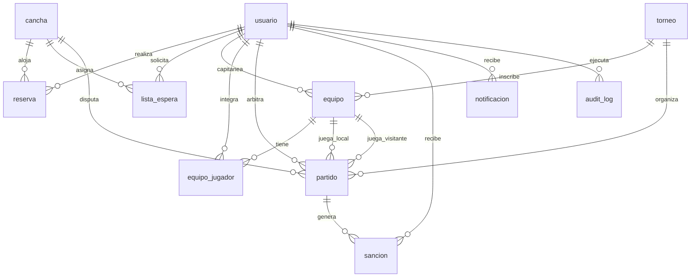

# 🗄️ Módulo de Base de Datos — Complejo Deportivo UB

> **Proyecto de Construcción de Software — Cátedra Prof. Lic. María Julia Monasterio**  
> **Universidad de Belgrano — Facultad de Ingeniería y Tecnología Informática**  
> **Motor:** MySQL 8.0+ / InnoDB / `utf8mb4_unicode_ci`  
> **Ubicación:** `/database`

---

## 📌 1. Visión General y Arquitectura de Datos

Este módulo implementa el modelo relacional para el sistema de gestión y administración de reservas y torneos del Complejo Deportivo UB. El diseño contempla:

- **11 tablas normalizadas** (3FN) con claves primarias autoincrementales `BIGINT`.
- **Integridad referencial estricta** (`FOREIGN KEY` con `ON DELETE CASCADE / RESTRICT / SET NULL` según corresponda).
- **Reglas de negocio embebidas en BD** mediante Procedimientos Almacenados (`STORED PROCEDURES`), restricciones `CHECK` y claves compuestas `UNIQUE`.
- **Modo de despliegue dual**: Docker Compose automatizado (`docker-entrypoint-initdb.d`) y soporte de fallback resiliente en el backend (`inMemoryStore`).

---

## 📁 2. Estructura de Archivos

| Archivo | Descripción |
| :--- | :--- |
| [`schema.sql`](file:///c:/Users/seba/complejo-deportivo-ub/database/schema.sql) | Script DDL que crea la base de datos `complejo_deportivo_ub`, las 11 tablas, índices de búsqueda rápida y constraints de validación. |
| [`procedures_and_triggers.sql`](file:///c:/Users/seba/complejo-deportivo-ub/database/procedures_and_triggers.sql) | Procedimientos almacenados para actualización de tabla de posiciones, cálculo de sanciones por inasistencia y políticas de cancelación/reintegro. |
| [`seeds.sql`](file:///c:/Users/seba/complejo-deportivo-ub/database/seeds.sql) | Datos iniciales maestros y de prueba: usuarios con hash bcrypt, canchas, torneos, equipos, nóminas, partidos y auditoría. |

---

## 🏗️ 3. Diagrama y Descripción de Tablas



### Detalle de las 11 Tablas

1. **`usuario`** (RF-01, RF-05, RF-12):
   - Campos: `id`, `nombre`, `email` (UNIQUE), `contrasena_hash`, `rol` (`Cliente`, `Administrador`, `Arbitro`), `inasistencias` (INT), `estado_cuenta` (`Activa`, `Suspendida`, `Inactiva`), `suspension_hasta` (DATETIME), `telefono`, `posicion_preferida`.
   - Índices: `idx_usuario_email`, `idx_usuario_rol`, `idx_usuario_estado`.

2. **`cancha`** (RF-02, RF-06):
   - Campos: `id`, `nombre`, `deporte` (`Futbol 5`, `Futbol 8`, `Futbol 11`, `Tenis`, `Padel`), `superficie`, `techada`, `iluminacion`, `precio_hora`, `activa`.
   - Restricciones: `chk_cancha_precio` (`precio_hora > 0`).

3. **`reserva`** (RF-03, RF-04, RF-05, RF-06):
   - Campos: `id`, `fk_usuario_id`, `fk_cancha_id`, `fecha`, `hora`, `monto_total`, `monto_sena`, `sena_abonada`, `estado` (`CONFIRMADA`, `CANCELADA`, `INASISTENCIA`, `FINALIZADA`), `devolucion_sena`, `asistencia_confirmada`, `notas_cancelacion`.
   - **Clave Única:** `uq_cancha_fecha_hora` (`fk_cancha_id`, `fecha`, `hora`) para evitar solapamientos de turnos.

4. **`lista_espera`** (RF-24):
   - Campos: `id`, `fk_usuario_id`, `fk_cancha_id`, `fecha`, `hora`, `estado` (`PENDIENTE`, `NOTIFICADO`, `CANCELADO`, `ASIGNADO`).
   - Gestión reactiva de liberación de turnos por orden FIFO (`created_at ASC`).

5. **`torneo`** (RF-07, RF-09):
   - Campos: `id`, `nombre`, `deporte`, `costo_inscripcion`, `valor_partido`, `max_equipos`, `min_jugadores_equipo`, `max_jugadores_equipo`, `fecha_inicio`, `fecha_fin`, `estado` (`INSCRIPCION_ABIERTA`, `EN_CURSO`, `FINALIZADO`, `CANCELADO`), `reglamento`.

6. **`equipo`** (RF-08, RF-11, RF-21):
   - Campos: `id`, `fk_torneo_id`, `fk_capitan_id`, `nombre`, `puntos`, `partidos_jugados`, `partidos_ganados`, `partidos_empatados`, `partidos_perdidos`, `goles_favor`, `goles_contra`, `diferencia_goles`, `inscripcion_pagada`.
   - Clave Única: `uq_equipo_nombre_torneo` (`fk_torneo_id`, `nombre`).

7. **`equipo_jugador`** (RF-08, RF-13, RF-14, RF-15, RF-16):
   - Campos: `fk_equipo_id`, `fk_usuario_id`, `dorsal`, `es_capitan`, `fecha_alta`, `estado_invitacion` (`PENDIENTE`, `ACEPTADA`, `RECHAZADA`), `fecha_respuesta`.
   - Clave Primaria Compuesta: `(fk_equipo_id, fk_usuario_id)`.

8. **`partido`** (RF-09, RF-10, RF-17, RF-18, RF-19, RF-21, RF-22):
   - Campos: `id`, `fk_torneo_id`, `fk_cancha_id`, `fk_equipo_local_id`, `fk_equipo_visitante_id` (NULL en fecha libre), `fk_arbitro_id` (NULL si no fue asignado), `numero_fecha`, `fecha`, `hora`, `estado` (`PROGRAMADO`, `DISPUTADO`, `SUSPENDIDO`, `REPROGRAMADO`), `goles_local`, `goles_visitante`, `observaciones`.

9. **`sancion`** (RF-05, RF-20):
   - Campos: `id`, `fk_usuario_id`, `fk_partido_id`, `tipo_sancion`, `descripcion`, `fecha_sancion`, `fk_creado_por_id`.

10. **`notificacion`** (RF-23):
    - Campos: `id`, `fk_usuario_id`, `titulo`, `mensaje`, `tipo`, `leida`, `created_at`.

11. **`audit_log`** (RF-26):
    - Campos: `id`, `fk_usuario_id`, `accion`, `entidad_afectada`, `entidad_id`, `detalles` (JSON text), `ip_address`, `created_at`.

---

## ⚙️ 4. Procedimientos Almacenados

### `sp_actualizar_tabla_posiciones(IN p_torneo_id BIGINT)`
- **Propósito:** Recalcula de forma atómica y completa la tabla de posiciones del torneo.
- **Regla:** Partidos `DISPUTADO` suman: Victoria = 3 pts, Empate = 1 pt, Derrota = 0 pts. Actualiza PJ, PG, PE, PP, GF, GC y balance neto `DG = GF - GC`.

### `sp_registrar_inasistencia(IN p_reserva_id BIGINT, IN p_admin_id BIGINT)`
- **Propósito:** Aplica la penalización por inasistencia (RF-05).
- **Regla:** Marca la reserva como `INASISTENCIA`, incrementa `usuario.inasistencias` y, al llegar a **3 faltas**, suspende automáticamente al usuario por **14 días corridos**, genera el registro en `sancion`, envía la `notificacion` e inserta la auditoría en `audit_log`.

### `sp_cancelar_reserva(IN p_reserva_id BIGINT, IN p_motivo TEXT)`
- **Propósito:** Ejecuta la política de cancelación y reasignación (RF-04 y RF-24).
- **Regla:** Si la diferencia `TIMESTAMPDIFF(HOUR, NOW(), inicio_reserva) > 24` se marca `devolucion_sena = true`, caso contrario `false`. Además, busca al primer usuario en `lista_espera` para ese turno y le envía una notificación prioritaria.

---

## 🚀 5. Cómo Ejecutar e Inicializar la Base de Datos

### Opción 1: Con Docker Compose (Recomendada)
Desde la raíz del repositorio:
```bash
# Levantar el servicio de base de datos MySQL 8
docker compose up -d db

# O levantar todo el stack integrado (BD + Backend + Frontend)
docker compose up -d
```
*Los scripts `schema.sql`, `seeds.sql` y `procedures_and_triggers.sql` se ejecutan automáticamente en orden en la primera inicialización gracias a los volúmenes configurados en `docker-compose.yml`.*

### Opción 2: Ejecución Manual en MySQL Server Local
```bash
mysql -u root -p < database/schema.sql
mysql -u root -p < database/seeds.sql
mysql -u root -p < database/procedures_and_triggers.sql
```

---

## 🔑 6. Cuentas de Acceso Precargadas (Seeds)

| Rol | Email | Contraseña | Estado / Notas |
| :--- | :--- | :--- | :--- |
| **Administrador** | `admin@complejoub.com` | `password123` | Control total, ABM canchas y reportes |
| **Árbitro** | `arbitro@complejoub.com` | `password123` | Carga de resultados y actas |
| **Árbitro 2** | `mperez@complejoub.com` | `password123` | Arbitraje de torneos |
| **Cliente / Capitán** | `lucas@gmail.com` | `password123` | Capitán de "Los Galácticos FC" |
| **Cliente / Jugador** | `juan@gmail.com` | `password123` | Jugador con invitaciones |
| **Cliente Sancionado** | `sancionado@gmail.com` | `password123` | Cuenta suspendida por 3 inasistencias |

---

## 📋 7. Tareas Pendientes / Hoja de Ruta para el Equipo

Para continuar avanzando en este módulo, se sugieren las siguientes tareas:

1. [ ] **Creación de Vistas SQL (`VIEWS`):**
   - Crear `vw_resumen_ocupacion` para optimizar consultas de porcentaje de ocupación diaria.
   - Crear `vw_recaudacion_torneos` y `vw_recaudacion_reservas` para el módulo de reportes contables.

2. [ ] **Triggers Automáticos:**
   - Incorporar un trigger `AFTER UPDATE ON partido` que invoque automáticamente `sp_actualizar_tabla_posiciones` cuando el estado pase a `DISPUTADO` o cambie el marcador de goles.

3. [ ] **Versionado y Migraciones:**
   - Configurar un gestor de migraciones (como Knex o Prisma) para aplicar cambios incrementales sin tener que recrear toda la base de datos con `DROP TABLE`.

4. [ ] **Script de Backup / Dump:**
   - Implementar un script `scripts/backup_db.bat` (o `.sh`) con `mysqldump` para respaldar la información de pruebas de forma ágil.

5. [ ] **Tests de Integración contra MySQL:**
   - Crear tests de integración en `backend/src/__tests__` que ejecuten transacciones y concurrencia directamente sobre el contenedor MySQL.
